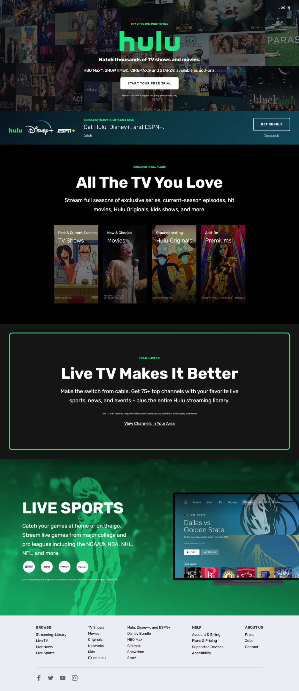

# Stream TV Movies Live Online

A professional landing page clone for a streaming service platform, focusing on clean UI, subscription bundles, and responsive design.

---

## 🚀 Features

* **Premium Header**: Features a call-to-action for free trials and highlights available premium add-ons like HBO Max™ and SHOWTIME®.
* **Subscription Bundles**: A dedicated sub-header section showcasing savings for Hulu, Disney+, and ESPN+ bundles.
* **Content Categories**: Organizes streaming options into TV Shows, Movies, Originals, and Premiums with interactive overlays.
* **Live TV Integration**: Showcases the Live TV plan which includes 75+ top channels and live sports.
* **Live Sports Section**: Highlights major college and pro leagues including NCAA®, NBA, NHL, and NFL with partner logos.
* **User Authentication**: Includes a stylized login modal with form controls for email and password entry.
* **Comprehensive Footer**: Detailed multi-column navigation for browsing libraries, help centers, and social media links.

## 🛠️ Technology Stack

* **HTML5**: Semantic structure for accessibility and SEO.
* **CSS3**: Custom styling managed via external `style.css`.
* **JavaScript**: Logic for modal functionality and site interactivity via `main.js`.

## 📁 Project Structure

* **index.html**: The main entry point containing all layout sections.
* **CSS/**: Contains `style.css` for the project's visual design.
* **JS/**: Contains `main.js` for handling frontend behaviors.
* **pictures/**: Directory for all site assets including logos, background images, and social icons.

---

## 👤 Author

* 👤 **Name**: MH Nahid

## 🌐 Social Media

* 📧 **Contact**: [Send an Email](mailto:mokbulhasannahid@gmail.com)